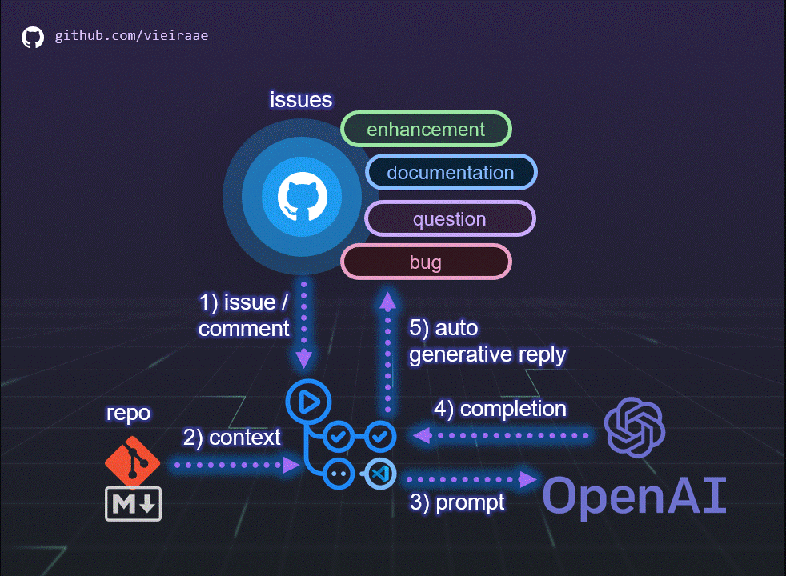

# Sample that uses GitHub Actions to generate automatic comments on GitHub Issues using OpenAI

You can use GitHub Actions to react on GitHub Issues. This sample is inspired by this possibility to auto generate a reply to an Issue with an OpenAI completion based on the context provided in the SAMPLE.md file.

